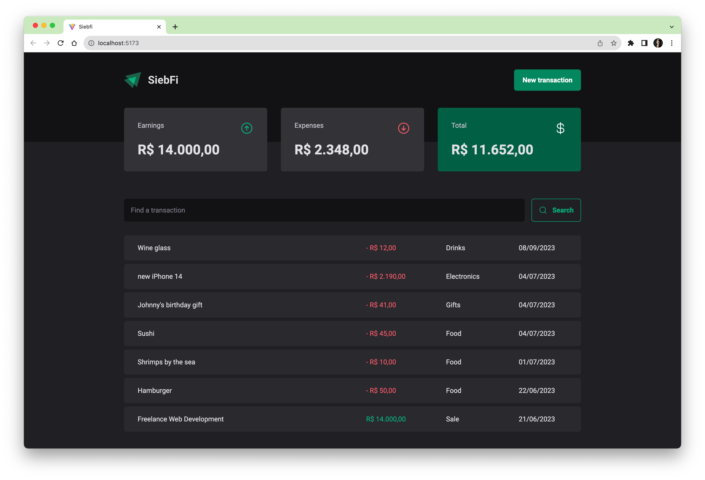

# Personal Finance Tracker




SIEBFI is a personal finance tracker – a web application that allows users to track their personal finances by managing their income and expenses. Users can add their income and expenses along with their corresponding values and categories. The app provides a table view of all the costs added by the user and a summary of their income, expenses, and total.

At the moment, it tracks finance of one single user. I might add authentication in the future:

## Technologies and challenges solved: 

- This project uses **React** and **TypeScript**
- The **JSON-server** library to simulate a server for managing the data and Axios to talk to that server as in a REST API.
- **Styled Components** was used for component-based styling using CSS-in-JS
- **Radix UI** was used to create a pop-up modal, used to add new transactions to the database when clicking on the "new transaction" button
- The **Context API** was used to provide TypeScript interfaces across the app as well as the transaction state, fetchTransactions and createTransaction functions
- A formatter was created to ensure dates and currencies would fit the Brazilian standard 

## Prerequisites

Before running the application, make sure you have the following software installed:

- Node.js
- npm (Node Package Manager)

## Getting Started

To run the application locally, follow these steps:

1. Clone the repository:

```bash
git clone https://github.com/guisiebert/siebfi.git
```

2. Navigate to the project directory:

```bash
cd siebfi
```

3. Install the dependencies:

```bash
npm install
```

4. Start the development server:

```bash
npm run dev
```

This will start the React development server.

5. Start the JSON server:

```bash
npm run dev:server
```

The JSON server is used to simulate a server for managing the data.

6. Open your browser and visit `http://localhost:5173` to see the application in action.


Project Link: [https://github.com/guisiebert/siebfi](https://github.com/guisiebert/siebfi)